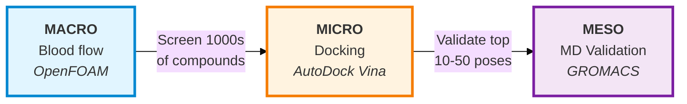
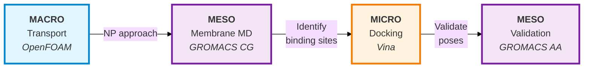

# NanoSim: Multi-Scale Nanomedicine Simulation Platform

[](https://www.gnu.org/licenses/agpl-3.0)
[](https://www.python.org/downloads/)
[](https://github.com/xiaojunyang0805/NanoSim/issues)
[](CONTRIBUTING.md)

> **Bridging scales from blood flow to molecular binding - democratizing nanomedicine simulation**

---

## 🎯 Vision

NanoSim is an open-source platform that integrates multi-scale simulations for nanomedicine research - from **macro** (tissue/organ transport) to **meso** (nanoparticle-cell interactions) to **micro** (molecular binding). We're making sophisticated drug delivery simulation accessible to researchers worldwide.

### The Problem We Solve

Current nanomedicine research requires:
- ❌ Multiple disconnected software tools (OpenFOAM, GROMACS, AutoDock)
- ❌ Manual data conversion between scales
- ❌ Deep expertise in computational chemistry, CFD, and MD
- ❌ Expensive commercial licenses ($10K+/year)
- ❌ Weeks to set up a single simulation workflow

### Our Solution

- ✅ **Unified platform** - All scales in one workflow
- ✅ **Automated data bridging** - Seamless scale transitions
- ✅ **User-friendly interface** - Web GUI + CLI
- ✅ **Open source core** - Free for research and education
- ✅ **Cloud-ready** - Run anywhere, scale infinitely
- ✅ **AI-assisted** - Smart parameter recommendations

---

## 🚀 Quick Start

> **Note:** NanoSim is currently in early development (Phase 1: Proof of Concept). The following instructions will be available in upcoming releases.

### Prerequisites

- Python 3.11 or higher
- Docker Desktop installed
- Git
- 8GB+ RAM recommended

### Installation (Coming Soon)

```bash
# Clone the repository
git clone https://github.com/xiaojunyang0805/NanoSim.git
cd NanoSim

# Create virtual environment
python -m venv venv
source venv/bin/activate  # On Windows: venv\Scripts\activate

# Install dependencies
pip install -r requirements.txt

# Verify installation
nanosim --version
```

---

## 🏗️ Architecture

### Multi-Scale Integration with Bidirectional Workflows

NanoSim supports **adaptive workflow routing** based on your research needs:

#### Standard Drug Discovery Workflow (Docking-First)

**Use when:** Known target, large compound libraries, standard screening
**Rationale:** Docking is fast ($0.01/compound) → MD is expensive ($10/compound)

#### Membrane Targeting Workflow (MD-First)

**Use when:** Nanoparticle delivery, membrane proteins, cryptic pockets
**Rationale:** Must understand membrane interactions before docking

### Intelligent Workflow Selection

NanoSim automatically selects the optimal workflow based on:
- Target type (soluble vs. membrane)
- Compound library size
- Computational budget
- Scientific goals

**This bidirectional capability is our competitive advantage!**

<br/>

### Technology Stack

**Backend:**
- Python 3.11+ (FastAPI)
- Docker & Kubernetes
- PostgreSQL + Redis
- Celery (task queue)

**Simulation Engines:**
- OpenFOAM (CFD - continuum transport)
- GROMACS (MD - molecular dynamics)
- AutoDock Vina (molecular docking)

**Frontend (Planned):**
- React + TypeScript
- Three.js (3D visualization)
- Plotly (interactive plots)

---

## 📁 Project Structure

```
NanoSim/
├── README.md                 # This file
├── LICENSE                   # AGPL-3.0
├── CONTRIBUTING.md           # Contribution guidelines
├── requirements.txt          # Python dependencies
├── requirements-dev.txt      # Development dependencies
├── setup.py                  # Package installation
├── pyproject.toml            # Python packaging config
├── docker-compose.yml        # Multi-container setup
│
├── docs/                     # Documentation
│   ├── architecture.md
│   ├── installation.md
│   └── tutorials/
│
├── src/nanosim/             # Main source code
│   ├── __init__.py
│   ├── cli.py               # Command-line interface
│   ├── api.py               # REST API (FastAPI)
│   │
│   ├── core/                # Core abstractions
│   │   ├── simulation.py    # Base simulation classes
│   │   └── bridge.py        # Base bridge classes
│   │
│   ├── engines/             # Simulation engine wrappers
│   │   ├── openfoam.py      # OpenFOAM interface
│   │   ├── gromacs.py       # GROMACS interface
│   │   └── autodock.py      # AutoDock Vina interface
│   │
│   ├── bridges/             # BIDIRECTIONAL scale conversion
│   │   ├── macro_to_meso.py # OpenFOAM → GROMACS
│   │   ├── meso_to_micro.py # GROMACS → Vina (MD-first)
│   │   └── micro_to_meso.py # Vina → GROMACS (docking-first)
│   │
│   ├── orchestrator/        # Intelligent workflow management
│   │   ├── workflow_router.py # Automatic workflow selection
│   │   ├── pipeline.py      # Job orchestration
│   │   ├── scheduler.py     # Task scheduling
│   │   └── monitor.py       # Progress tracking
│   │
│   ├── workflows/           # Pre-configured workflows
│   │   ├── standard_vs.py   # Standard virtual screening
│   │   └── membrane_targeting.py # Nanoparticle targeting
│   │
│   ├── validation/          # Quality control
│   │   ├── md_stability.py  # MD stability metrics
│   │   └── pose_validator.py # Docking pose validation
│   │
│   └── utils/               # Utilities
│       ├── validators.py    # Input validation
│       └── logger.py        # Logging
│
├── docker/                  # Docker configurations
│   ├── openfoam.Dockerfile
│   ├── gromacs.Dockerfile
│   └── autodock.Dockerfile
│
├── examples/                # Example workflows
│   └── liposome_her2/       # Cancer targeting example
│
├── tests/                   # Test suite
│   ├── unit/
│   └── integration/
│
└── landing-page/            # Landing page files
    ├── index.html
    ├── styles.css
    └── script.js
```

---

## 🛠️ Development Roadmap

### Phase 1: Proof of Concept (Current - Month 6) ⏳

- [x] Manual workflow validation
- [x] Architecture design (including bidirectional workflows)
- [x] Core abstractions (SimulationEngine, ScaleBridge)
- [x] Workflow router with intelligent selection
- [x] Bidirectional bridge interfaces
- [ ] Docker containerization
- [ ] Python wrappers for each engine
- [ ] Basic CLI interface
- [ ] Standard workflow: Docking → MD validation
- [ ] Membrane workflow: MD → Docking → MD validation
- [ ] Example: HER2-targeted liposome (revised workflow)

### Phase 2: MVP (Months 7-12)

- [ ] Web-based interface
- [ ] User authentication
- [ ] Cloud job execution
- [ ] All three scales integrated
- [ ] Visualization dashboard
- [ ] API documentation
- [ ] Beta testing with 10+ users

### Phase 3: AI Integration (Months 13-18)

- [ ] AI parameter recommendations
- [ ] Natural language interface
- [ ] Automated result interpretation
- [ ] Interactive learning modules

---

## 🤝 Contributing

We welcome contributions from the community! Whether you're fixing bugs, adding features, improving documentation, or sharing workflows, your help is valuable.

### How to Contribute

1. **Fork the repository**
2. **Create a feature branch** (`git checkout -b feature/amazing-feature`)
3. **Commit your changes** (`git commit -m 'Add amazing feature'`)
4. **Push to the branch** (`git push origin feature/amazing-feature`)
5. **Open a Pull Request**

See [CONTRIBUTING.md](CONTRIBUTING.md) for detailed guidelines.

### Contribution Areas

- 🐛 **Bug fixes** - Found an issue? Fix it!
- ✨ **New features** - Add simulation capabilities
- 📚 **Documentation** - Improve guides and tutorials
- 🧪 **Validation** - Compare results with literature
- 🎨 **UI/UX** - Make the interface better
- 🔬 **Workflows** - Share your simulation setups

---

## 📖 Documentation

- [Project Overview & Vision](https://nanosim.seenano.nl) - Visit our landing page
- [Project Motivation](docs/motivation.md) - Detailed vision and technical approach
- [Installation Guide](docs/installation.md) *(Coming soon)*
- [Architecture Deep Dive](docs/architecture.md) *(Coming soon)*
- [User Guide](docs/user-guide.md) *(Coming soon)*
- [API Reference](docs/api-reference.md) *(Coming soon)*

---

## 🎓 Citation

If you use NanoSim in your research, please cite:

```bibtex
@software{nanosim2025,
  author = {NanoSim Project Contributors},
  title = {NanoSim: Multi-Scale Nanomedicine Simulation Platform},
  year = {2025},
  url = {https://github.com/xiaojunyang0805/NanoSim},
  version = {0.1.0}
}
```

Also cite the underlying tools:
- OpenFOAM: https://www.openfoam.com/
- GROMACS: https://www.gromacs.org/
- AutoDock Vina: https://vina.scripps.edu/

---

## 📄 License

This project is licensed under the **GNU Affero General Public License v3.0 (AGPL-3.0)**.

**What this means:**
- ✅ Free to use for research, education, and commercial purposes
- ✅ Can modify and redistribute
- ✅ Must share modifications if you distribute or host as a service
- ✅ Must keep the same license

See [LICENSE](LICENSE) for full details.

---

## 🌟 Community

### Join Us!

- **Website:** [nanosim.seenano.nl](https://nanosim.seenano.nl) *(Coming soon)*
- **GitHub:** [github.com/xiaojunyang0805/NanoSim](https://github.com/xiaojunyang0805/NanoSim)
- **Email:** support@seenano.nl
- **Discussions:** [GitHub Discussions](https://github.com/xiaojunyang0805/NanoSim/discussions)

### Getting Help

1. **Check the [FAQ](docs/faq.md)** *(Coming soon)*
2. **Search [GitHub Issues](https://github.com/xiaojunyang0805/NanoSim/issues)**
3. **Post in [Discussions](https://github.com/xiaojunyang0805/NanoSim/discussions)**
4. **Email:** support@seenano.nl

### Reporting Issues

Found a bug? Please report it!

- Use the [Bug Report Template](.github/ISSUE_TEMPLATE/bug_report.md) *(Coming soon)*
- Include system info (OS, Python version, Docker version)
- Provide minimal reproducible example
- Attach relevant logs

---

## 🗺️ Vision for the Future

### Our Goals

1. **Become the standard** for nanomedicine simulation research
2. **10,000+ researchers** using the platform by 2030
3. **100+ published papers** utilizing NanoSim
4. **Accelerate drug development** through better simulation
5. **Reduce animal testing** by enabling in-silico prediction

---

## 🙏 Acknowledgments

This project builds on decades of open-source scientific software development. We thank:

- OpenFOAM Foundation and contributors
- GROMACS development team
- AutoDock team at Scripps Research
- Python scientific computing community
- All beta testers and early adopters

---

## 📬 Contact

**Project Lead:** Xiaojun Yang
**Email:** support@seenano.nl
**GitHub:** [@xiaojunyang0805](https://github.com/xiaojunyang0805)

---

## 🚀 Current Status

**Phase:** Proof of Concept (Month 1)
**Version:** 0.1.0-dev
**Last Updated:** October 25, 2025

**Latest Updates:**
- ✅ Project structure and documentation established
- ✅ Landing page created
- ⏳ Docker containerization in progress
- ⏳ Setting up development environment

---

<p align="center">
  <b>⭐ Star us on GitHub if you find this project interesting! ⭐</b>
</p>

<p align="center">
  Made with ❤️ by the NanoSim Community
</p>

<p align="center">
  <sub>Building the future of nanomedicine simulation, one scale at a time.</sub>
</p>
