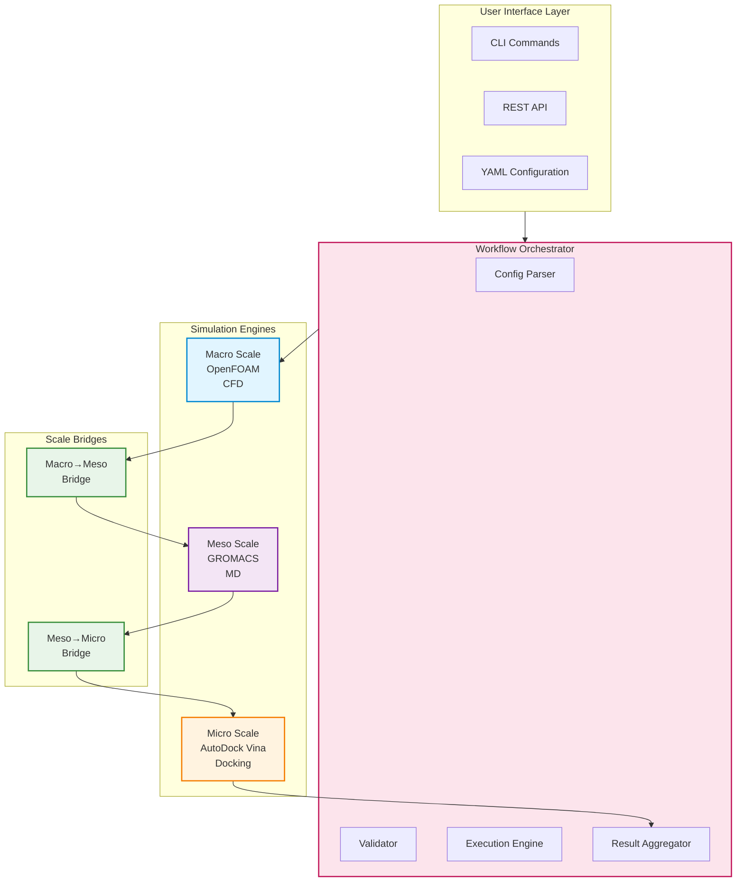
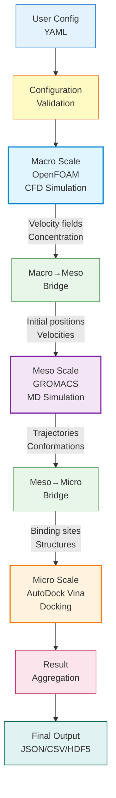

# Architecture Overview

NanoSim is designed as a multi-scale simulation platform that bridges three distinct computational scales relevant to nanomedicine.

## Design Principles

1. **Modularity**: Each simulation engine is encapsulated in its own module
2. **Abstraction**: Common interfaces for all simulation types
3. **Extensibility**: Easy to add new engines or scale bridges
4. **Reproducibility**: Configuration-driven, version-controlled workflows

## System Architecture



## Core Components

### Simulation Engines

Each simulation engine implements the `SimulationEngine` abstract base class:

```python
class SimulationEngine(ABC):
    @abstractmethod
    def validate_config(self) -> None:
        """Validate engine configuration."""

    @abstractmethod
    def setup(self) -> None:
        """Set up simulation environment."""

    @abstractmethod
    def run(self) -> SimulationResult:
        """Execute simulation."""

    @abstractmethod
    def cleanup(self) -> None:
        """Clean up resources."""
```

### Scale Bridges

Scale bridges convert outputs from one scale to inputs for the next:

- **MacroToMesoBridge**: Converts CFD results (velocity fields, concentration gradients) to MD initial conditions
- **MesoToMicroBridge**: Converts MD trajectories (conformations, binding sites) to docking inputs

### Workflow Orchestrator

Manages the execution flow:

1. Parse configuration
2. Validate inputs
3. Execute simulations in sequence
4. Bridge data between scales
5. Collect and aggregate results

### CLI and API

- **CLI**: Command-line interface for interactive use
- **API**: REST API for programmatic access and integration

## Data Flow



## Technology Stack

- **Language**: Python 3.11+
- **CLI**: Click
- **API**: FastAPI
- **Testing**: Pytest
- **Documentation**: MkDocs with Material theme
- **Containerization**: Docker
- **CI/CD**: GitHub Actions

## Next Steps

- [Multi-scale Approach](multiscale.md) - Deep dive into scale integration
- [Scale Bridging](bridging.md) - Data conversion details
